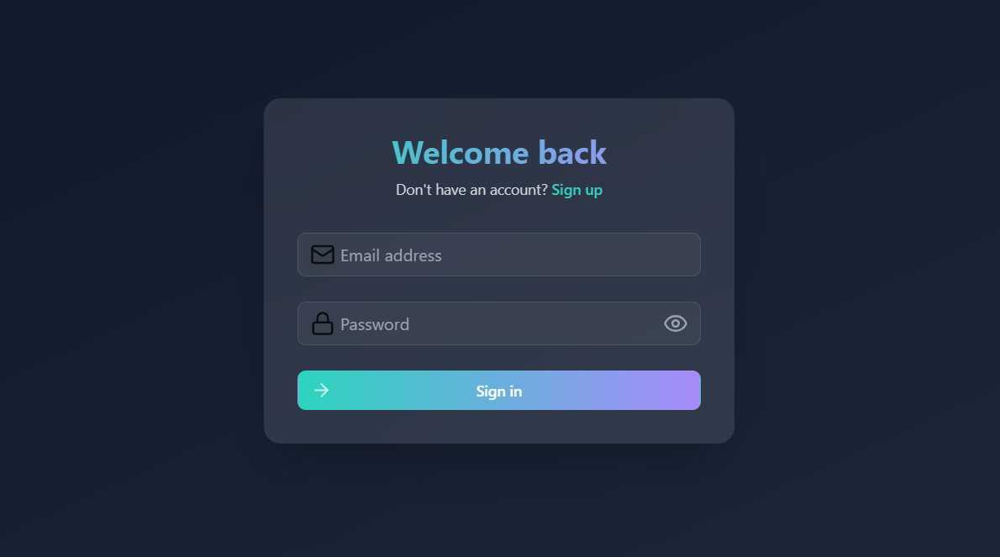
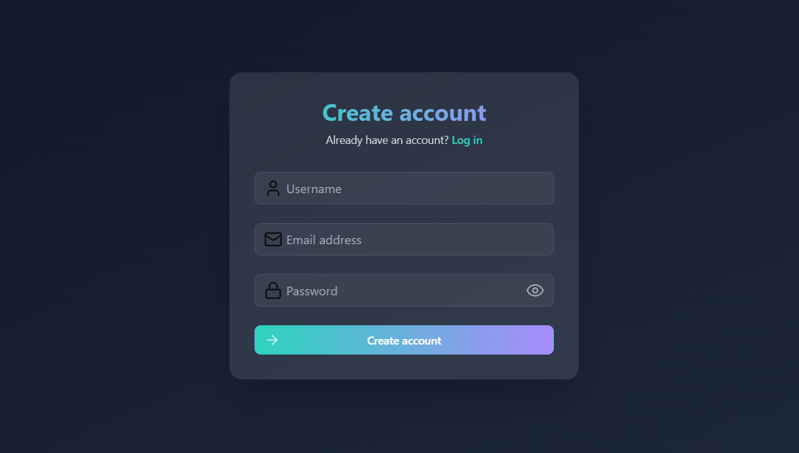

# Login-SignUp

### Une application moderne pour la gestion des authentifications

---

## Table des matières

- [Aperçu](#aperçu)
- [Fonctionnalités](#fonctionnalités)
- [Technologies](#technologies)
- [Déploiement](#déploiement)
- [Auteur](#auteur)

---

## Aperçu

**Login-SignUp** est une application moderne et intuitive conçue pour gérer efficacement les processus de connexion et inscription. Avec une interface simple et élégante, cette application permet aux utilisateurs de s’inscrire, de se connecter et de gérer leur profil en toute simplicité. Que ce soit sur un ordinateur, une tablette ou un smartphone, **Login-SignUp** s'adapte parfaitement à tous les écrans grâce à son design responsive.

Le projet utilise **React.js** et **Tailwind CSS** pour offrir une expérience utilisateur fluide et rapide. Il est facile à personnaliser et à intégrer dans vos propres projets.

---

## Aperçu visuel

### Desktop View

---

## Fonctionnalités

- **Formulaire de connexion** : Permet aux utilisateurs de s’identifier à l’application.
- **Formulaire d’inscription** : Offre aux nouveaux utilisateurs la possibilité de créer un compte.
- **Validation des formulaires** : Intégration de **React Hook Form** pour gérer efficacement la validation.
- **Réinitialisation du mot de passe** : Offre la possibilité de réinitialiser le mot de passe via email.
- **Gestion des erreurs** : Messages d’erreur clairs et explicites pour guider les utilisateurs.
- **Responsive Design** : Optimisé pour une utilisation fluide sur tous les appareils.
- **Transitions fluides** : Animations et effets modernes pour une expérience interactive.

---

## Technologies

- **React.js** : Framework JavaScript pour construire une interface utilisateur dynamique.
- **Tailwind CSS** : Framework CSS utilitaire pour un design rapide et flexible.
- 
---

## Déploiement

L'application est déployée sur [Login-SignUp App](https://elgargati.github.io/Login-SignUp/).

---

## Auteur

- **Mohammed El Gargati**
- GitHub : [Elgargati](https://github.com/Elgargati)

---

N'hésitez pas à me contacter si vous avez des questions ou des suggestions !
